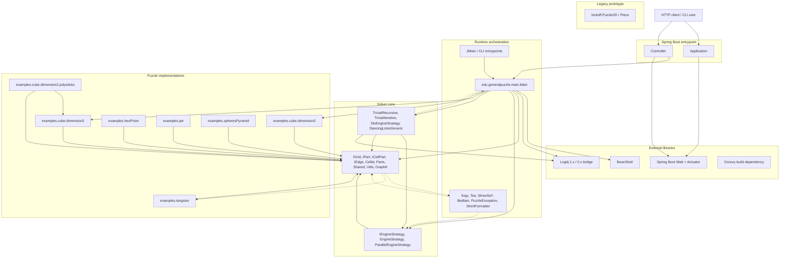

# System Architecture

This repository is a single Java module, but the code is organized into clear internal layers:

- `edu.generalpuzzle` is the Spring Boot HTTP entrypoint.
- `edu.generalpuzzle.main` is the primary runtime/CLI orchestration layer.
- `edu.generalpuzzle.infra` holds the solver abstractions and shared engine state.
- `edu.generalpuzzle.infra.engines` contains the concrete solving strategies.
- `edu.generalpuzzle.examples` contains puzzle-specific grids, parts, and edge definitions.
- `edu.generalpuzzle.kickoff` is a standalone legacy polyomino backtracking prototype.

## Mermaid Diagram

## Dependency Notes

- `Controller` exposes `GET /solve/{problemId}` and delegates directly to `main.Main`.
- `main.Main` is the central orchestrator. It loads puzzle definitions from `config/*.bsh`, selects an engine, and runs the solver.
- `infra` is the shared solver layer. `Parts`, `IGrid`, `IPart`, and related types are the main abstractions used by every engine and puzzle implementation.
- `infra.engines` depends on `infra` and contains the real solver strategies:
  - `DlxEngineStrategy` implements the dancing-links solver.
  - `TrivialRecursiveEngineStrategy` and `TrivialIterativeEngineStrategy` implement backtracking variants.
- `examples` depends on `infra` and provides concrete puzzle layouts, edges, and part definitions.
- There are a few reverse or incidental dependencies worth noting:
  - `infra.IPart` imports `examples.tangram.CellPartTang`.
  - `infra.Parts` imports `main.PuzzleException`.
  - `TrivialIterativeEngineStrategy` imports `main.Main`.
- `kickoff` is effectively a separate proof-of-concept solver and is not part of the Spring Boot request path.

## Build-Level Dependencies

From `build.gradle` / `pom.xml`, the module currently depends on:

- Spring Boot Web
- Spring Boot Actuator
- Spring Boot Test
- BeanShell
- Log4j (`log4j-1.2-api`, `log4j-api`, `log4j-core`)
- Groovy
